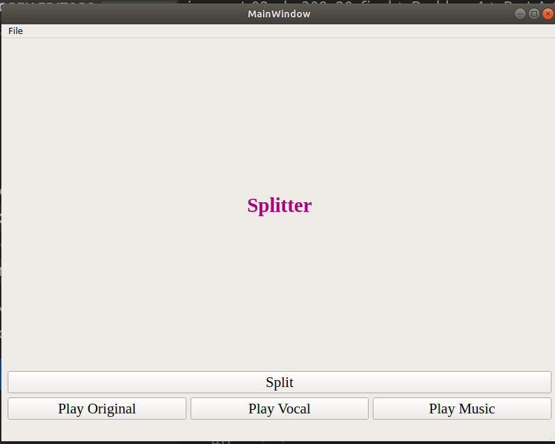
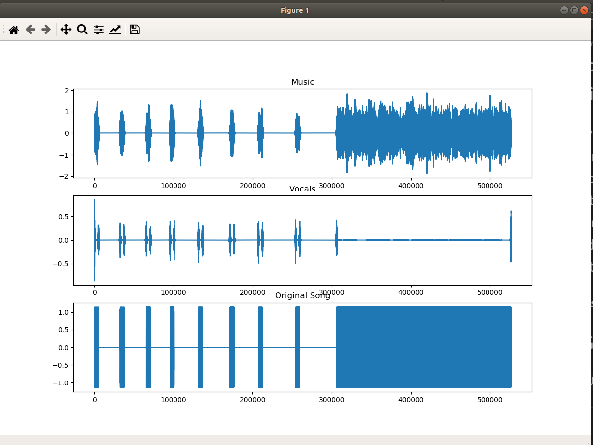

# Problem 4 Part A

## We are required to split vocals and music , so in this part we use different algorithm than FAST ICA .

### Here we Used Librosa to take the song as an input and separate it as magnitude and phase then apply filter on the magnitude and after that reconstruct two different outputs and their differencies is the result of the diffrent mask applied to the magnitude and it's obviosly reconstructed with the same phase .
#### NB : This method used fft and ifft 

## The GUI 
> 

> #### Here You can choose a wav audio file then hit Split and Voila!! 
> #### You can press "Play Vocal" to listen to the vocal ouput
> #### Or press " Play Music" to listen to the music output , Also another option to compare results with original is "Play Original"

### <i>An Additional graph is plotted to see the difference in the input and outputs wave form .</i>

> 

#### The output audio results will be saved at the same directory as this file named <u>(song-name)_music.wav </u>  and  <u>(song-name)_vocals.wav</u> .

>#### Attached in this folder an example for input and outputs and also an ecg track .